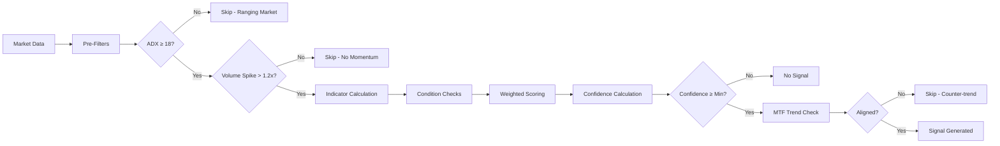
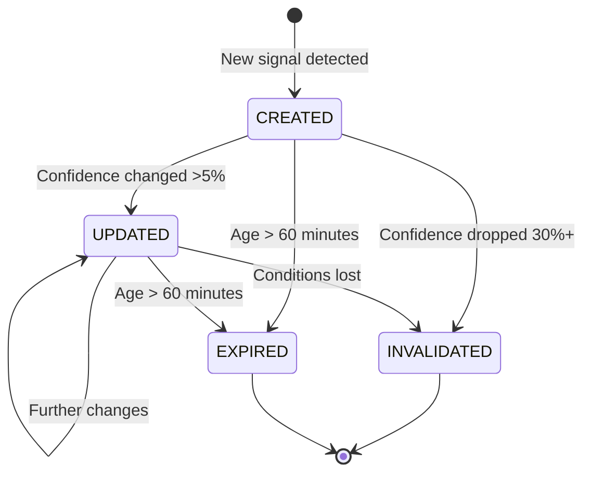

# Signal Generation Logic

## Overview

The trading bot uses a **weighted multi-indicator scoring system** to generate LONG and SHORT signals. Each signal requires meeting a minimum confidence threshold calculated from 14 technical indicators plus pre-filters for market conditions.

## Strategy Type

**RSI-based Mean Reversion with Trend Confirmation**

- LONG signals: Buy when oversold (RSI 23-33) with bullish confirmation
- SHORT signals: Sell when overbought (RSI 67-77) with bearish confirmation

## Signal Flow



---

## Pre-Trade Filters

### 1. Ranging Market Filter (ADX < 18)
Signals are **skipped** when ADX < 18 to avoid false breakouts in choppy markets.

### 2. Volume Spike Confirmation
Requires volume > **1.2x** the 20-period moving average to confirm momentum.

### 3. Multi-Timeframe Confirmation
| Current TF | Requires | Action |
|------------|----------|--------|
| 15m | 1h trend alignment | LONG skipped if 1h is BEARISH, SHORT skipped if 1h is BULLISH |
| 1h | 4h trend alignment | LONG skipped if 4h is BEARISH, SHORT skipped if 4h is BULLISH |
| 4h | None | Proceeds without confirmation |
| 1d | None | Proceeds without confirmation |

Trend determination uses **EMA9 vs EMA50** crossover on higher timeframe.

---

## Technical Indicators Used (14 Total)

| # | Indicator | Weight | Purpose |
|---|-----------|--------|---------|
| 1 | Fibonacci Pullback | 2.5 | Golden ratio zone confirmation (50%-61.8%) |
| 2 | MACD | 2.0 | Momentum crossover detection |
| 3 | SuperTrend | 1.9 | Trend following confirmation |
| 4 | Price vs EMA50 | 1.8 | Trend direction |
| 5 | ADX | 1.7 | Trend strength measurement |
| 6 | Heikin Ashi | 1.6 | Smoothed trend direction |
| 7 | RSI | 1.5 | Overbought/oversold levels |
| 8 | Volume | 1.4 | Interest confirmation |
| 9 | MFI | 1.3 | Volume-weighted momentum |
| 10 | EMA Alignment | 1.2 | Multi-timeframe alignment |
| 11 | Parabolic SAR | 1.1 | Trend reversal detection |
| 12 | +DI/-DI | 1.0 | Directional movement |
| 13 | Bollinger Bands | 0.8 | Volatility and price extremes |
| 14 | Volatility (ATR) | 0.5 | Market condition adjustment |

**Total Max Score: ~20.3** (with Fibonacci enabled)

---

## LONG Signal Conditions

| # | Condition | Scoring |
|---|-----------|---------|
| 1 | **MACD Crossover** | +2.0 if histogram crosses from negative to positive |
| 2 | **RSI Favorable** | +1.5 if RSI 23-33 (oversold) OR +0.75 if RSI rising |
| 3 | **Price Above EMA50** | +1.8 if close > EMA50 |
| 4 | **Strong Trend** | +1.7 if ADX > 25 (base config) |
| 5 | **Heikin Ashi Bullish** | +1.6 if green HA candle |
| 6 | **Volume Spike** | +1.4 if volume > 1.2x avg OR +0.7 if volume > 1.0x |
| 7 | **EMA Alignment** | +1.2 if EMA9 > EMA21 > EMA50 |
| 8 | **Positive DI** | +1.0 if +DI > -DI (scaled by difference) |
| 9 | **Bollinger Favorable** | +0.8 if 0.3 < BB_position < 0.7 OR +0.56 if < 0.3 |
| 10 | **Low Volatility** | +0.5 if ATR% < 2% OR +0.25 if < 4% |
| 11 | **SuperTrend Bullish** | +1.9 if price above SuperTrend |
| 12 | **MFI Favorable** | +1.3 if MFI 20-50 OR +0.78 if rising |
| 13 | **PSAR Bullish** | +1.1 if price above Parabolic SAR |
| 14 | **Fibonacci Pullback** | +2.5 if price in 50%-61.8% retracement zone |

---

## SHORT Signal Conditions

| # | Condition | Scoring |
|---|-----------|---------|
| 1 | **MACD Crossover** | +2.0 if histogram crosses from positive to negative |
| 2 | **RSI Favorable** | +1.5 if RSI 67-77 (overbought) OR +0.75 if RSI falling |
| 3 | **Price Below EMA50** | +1.8 if close < EMA50 |
| 4 | **Strong Trend** | +1.7 if ADX > 25 (base config) |
| 5 | **Heikin Ashi Bearish** | +1.6 if red HA candle |
| 6 | **Volume Spike** | +1.4 if volume > 1.2x avg OR +0.7 if volume > 1.0x |
| 7 | **EMA Alignment** | +1.2 if EMA9 < EMA21 < EMA50 |
| 8 | **Negative DI** | +1.0 if -DI > +DI (scaled by difference) |
| 9 | **Bollinger Favorable** | +0.8 if 0.3 < BB_position < 0.7 OR +0.56 if > 0.7 |
| 10 | **Low Volatility** | +0.5 if ATR% < 2% OR +0.25 if < 4% |
| 11 | **SuperTrend Bearish** | +1.9 if price below SuperTrend |
| 12 | **MFI Favorable** | +1.3 if MFI 50-80 OR +0.78 if falling |
| 13 | **PSAR Bearish** | +1.1 if price below Parabolic SAR |
| 14 | **Fibonacci Pullback** | +2.5 if price in 50%-61.8% retracement zone |

---

## Confidence Calculation

```
Raw Confidence = (Sum of Triggered Weights) / (Maximum Possible Score)
```

A **non-linear transformation** is applied to prevent unrealistically high confidence:

| Raw Score | Adjusted Confidence |
|-----------|---------------------|
| 88-100% | 78-92% |
| 75-88% | 68-78% |
| 0-75% | 0-68% |

**Maximum confidence is capped at 92%**

---

## Risk Management

### ATR-Based Stop Loss and Take Profit

| Timeframe | SL Multiplier | TP Multiplier | R/R Ratio | Breakeven WR |
|-----------|---------------|---------------|-----------|--------------|
| 15m | 3.0x ATR | 9.0x ATR | 1:3.0 | 25% |
| 1h | 3.0x ATR | 9.0x ATR | 1:3.0 | 25% |
| 4h | 3.0x ATR | 9.0x ATR | 1:3.0 | 25% |
| 1d | 4.0x ATR | 12.0x ATR | 1:3.0 | 25% |

### Calculation Examples

**LONG Signal at $100 (4h, ATR = $2):**
- Entry: $100.00
- Stop Loss: $94.00 (Entry - 3.0 × $2 ATR)
- Take Profit: $118.00 (Entry + 9.0 × $2 ATR)

**SHORT Signal at $100 (4h, ATR = $2):**
- Entry: $100.00
- Stop Loss: $106.00 (Entry + 3.0 × $2 ATR)
- Take Profit: $82.00 (Entry - 9.0 × $2 ATR)

---

## Configuration Parameters

### Base Binance Configuration
```python
BINANCE_CONFIG = {
    # LONG Signal
    "long_rsi_min": 23.0,
    "long_rsi_max": 33.0,
    "long_adx_min": 25.0,
    "long_volume_multiplier": 1.2,

    # SHORT Signal
    "short_rsi_min": 67.0,
    "short_rsi_max": 77.0,
    "short_adx_min": 25.0,

    # Risk Management
    "sl_atr_multiplier": 3.0,
    "tp_atr_multiplier": 7.0,

    # Quality
    "min_confidence": 0.73,
    "signal_expiry_minutes": 60,
}
```

### Timeframe-Specific Overrides

| Timeframe | ADX Min | Confidence | SL ATR | TP ATR | Notes |
|-----------|---------|------------|--------|--------|-------|
| 15m | 30.0 | 78% | 3.0x | 9.0x | Very strict - strong trends only |
| 1h | 28.0 | 75% | 3.0x | 9.0x | Higher confidence required |
| 4h | 25.0 | 73% | 3.0x | 9.0x | Optimized sweet spot |
| 1d | 30.0 | 70% | 4.0x | 12.0x | Wide for swing trades |

---

## Fibonacci Pullback Detection

The bot identifies swing high/low points and calculates Fibonacci retracement levels:

| Level | Meaning |
|-------|---------|
| 38.2% | Shallow retracement |
| 50.0% | Half retracement |
| 61.8% | Golden ratio (primary entry zone) |
| 78.6% | Deep retracement |

**Entry Zone: 50% to 61.8% retracement (Golden Zone)**

Parameters:
- Lookback: 50 candles
- Entry Zone: 0.5 - 0.618 (50% to 61.8%)

When price pulls back to this zone after a trend move, it confirms a high-probability entry.

---

## Signal Lifecycle



---

## Timeframes Supported

| Timeframe | Use Case | MTF Check |
|-----------|----------|-----------|
| 15m | Scalping | Requires 1h confirmation |
| 1h | Intraday | Requires 4h confirmation |
| 4h | Swing trading | No confirmation needed |
| 1d | Position trading | No confirmation needed |

---

## Volatility-Aware Mode (Optional)

When enabled, parameters auto-adjust based on symbol volatility classification:

| Volatility | Example | SL | TP | ADX | Confidence |
|------------|---------|----|----|-----|------------|
| Low | BTC | Tighter | Tighter | Lower | Standard |
| Medium | ETH, SOL | Standard | Standard | Standard | Standard |
| High | DOGE, SHIB | Wider | Wider | Higher | Higher |

---

## Mathematical Requirements for Profitability

With 1:3 Risk/Reward ratio:
```
Breakeven Win Rate = 1 / (1 + R/R) = 1 / (1 + 3) = 25%
```

**Any win rate above 25% will be profitable with this strategy.**

---

## Signal Output Format

```json
{
  "symbol": "BTCUSDT",
  "direction": "LONG",
  "entry_price": 42000.00,
  "stop_loss": 40740.00,
  "take_profit": 45780.00,
  "confidence": 0.78,
  "timeframe": "4h",
  "status": "ACTIVE",
  "description": "LONG setup: MACD crossover, RSI 28.5, ADX 26.3 (12/14 conditions)",
  "meta": {
    "fib_zone": true,
    "current_price": 42000.00,
    "fib_50": 41800.00,
    "fib_61_8": 41500.00
  },
  "created_at": "2024-12-16T10:30:00Z"
}
```

---

## Performance Metrics (Optimized Configuration)

Based on backtesting (DOGEUSDT 4h, 11 months):

| Metric | Previous (OPT6) | Current (Optimized) |
|--------|-----------------|---------------------|
| ROI | -0.03% | **+0.74%** ✅ |
| Win Rate | 16.7% | **30.77%** ✅ |
| Profit Factor | < 1.0 | **1.26** ✅ |
| Trades | 6 | 52 |
| Parameters | ADX 26/28, SL 1.5x, TP 5.25x | ADX 25, SL 3.0x, TP 7.0x |

**Key Improvements:**
- Wider stops (3.0x ATR) = fewer premature stop-outs
- Higher targets (7.0x ATR) = better profit potential
- Win rate nearly DOUBLED (16.7% → 30.77%)
- Strategy is now **PROFITABLE**

---

## Source Files

| File | Purpose |
|------|---------|
| `scanner/strategies/signal_engine.py` | Main signal detection engine |
| `scanner/config/user_config.py` | User-configurable parameters |
| `scanner/indicators/indicator_utils.py` | Technical indicator calculations |
| `scanner/services/fib_utils.py` | Fibonacci pullback detection |
| `scanner/services/volatility_classifier.py` | Volatility-aware configuration |
